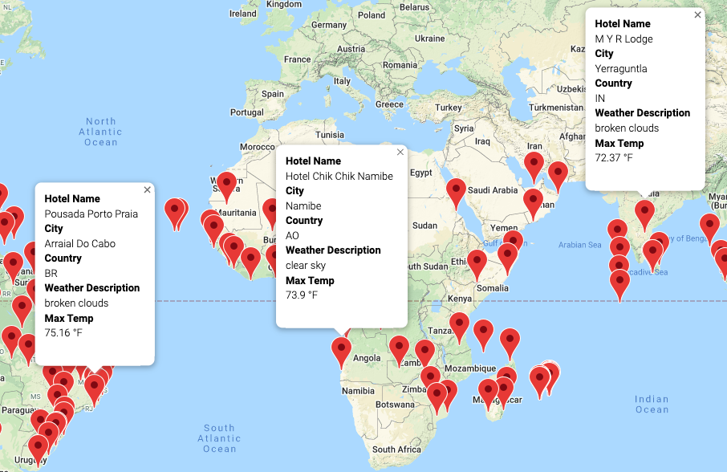
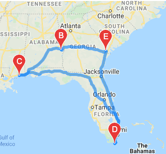

# World_Weather_Analysis

## Overview of Project
The main purpose of this project is to analyze, collect and visualize the weather around the world and provide the weather overwiew, based on desired termperature range.

### Results

A random was created with a set of 2,000 latitudes and longitudes, and the and API was generated based on the actual weather data focusing on the nearest cities. 
  
The main data retrieved from the API are: Latitude and longitude, Percent humidity, Maximum temperature, Percent cloudiness, Current Weather description, and Wind speed.

Output map of available locations.

 
Travelers can find potential destination or hotel nearby based on their preferences. The map showcases destinations using pop-up markers on a marker layer-map.

Travel Map. 

Though the use of the Google Directions API, the travellers can get a sample itinerary which shows the route recommendation to arrive to the destiny. 

Travel Map including Hotel names.

